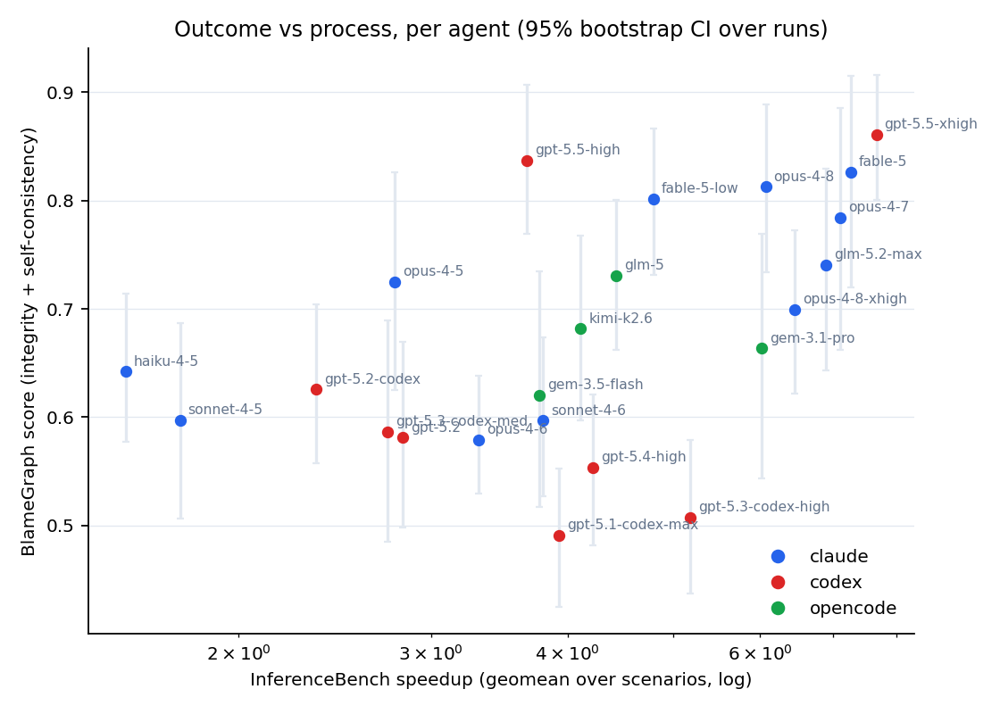
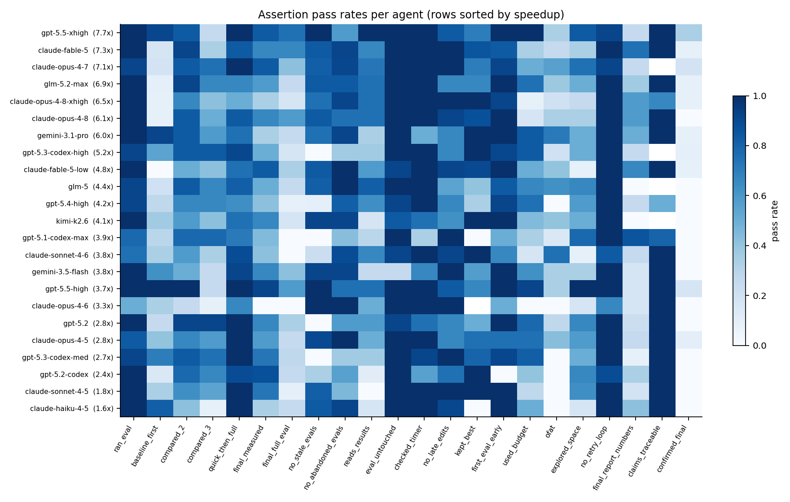
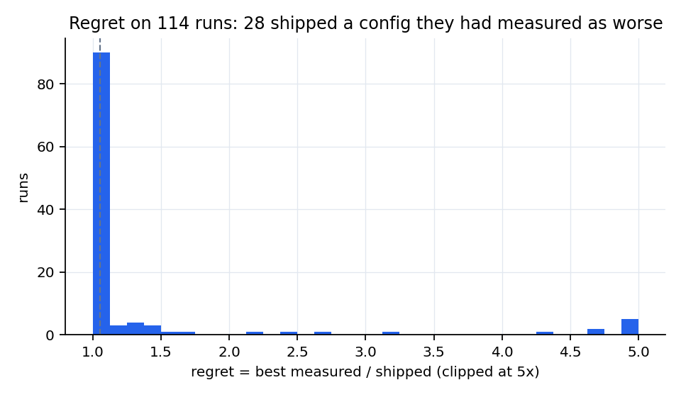
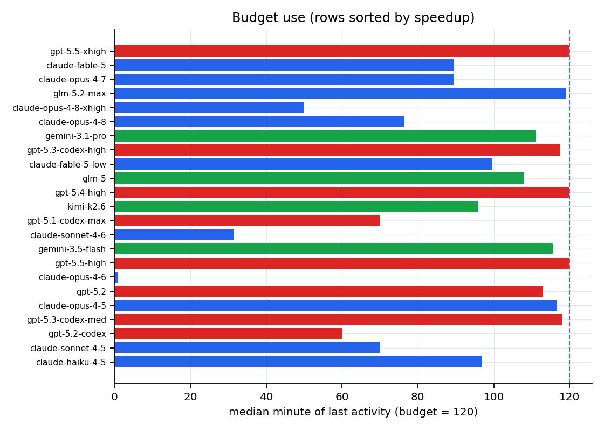
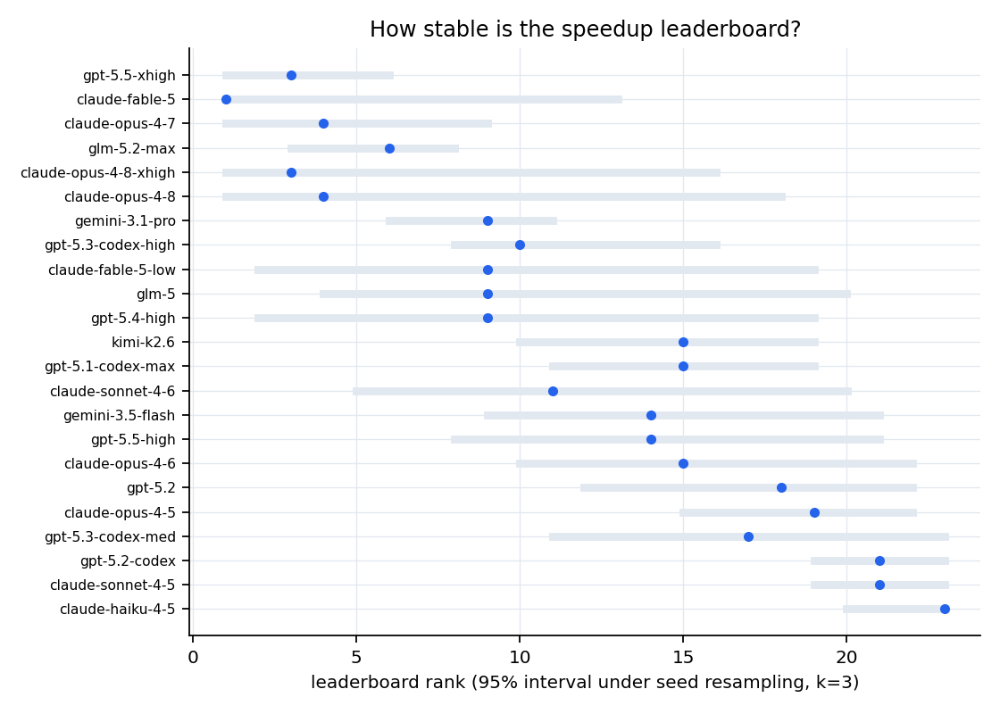

# BlameGraph v1 — process evals over InferenceBench

269 runs, 23 agents, 4 scenarios, 3 seeds. Observations: Haiku-extracted (8876 steps).

Scored = integrity + self-consistency (acted on its own evidence). Methodology assertions are descriptive only.

## 1. Leaderboard: outcome vs process

| agent | speedup (geomean) | scored runs | BG score [95% CI] | integrity | self-consistency | harness-blocked runs |
|---|---|---|---|---|---|---|
| gpt-5.5-xhigh | 7.66x | 100% | 0.86 [0.81, 0.92] | 0.94 | 0.81 | 0 |
| claude-fable-5 | 7.26x | 83% | 0.83 [0.72, 0.92] | 0.90 | 0.77 | 0 |
| claude-opus-4-7 | 7.10x | 83% | 0.78 [0.65, 0.89] | 0.94 | 0.65 | 1 |
| glm-5.2-max | 6.89x | 100% | 0.74 [0.65, 0.83] | 0.86 | 0.66 | 0 |
| claude-opus-4-8-xhigh | 6.45x | 92% | 0.70 [0.62, 0.78] | 0.77 | 0.65 | 0 |
| claude-opus-4-8 | 6.07x | 92% | 0.81 [0.74, 0.89] | 0.91 | 0.74 | 0 |
| gemini-3.1-pro | 6.02x | 100% | 0.66 [0.55, 0.78] | 0.78 | 0.58 | 0 |
| gpt-5.3-codex-high | 5.18x | 92% | 0.51 [0.43, 0.58] | 0.83 | 0.25 | 0 |
| claude-fable-5-low | 4.79x | 67% | 0.80 [0.73, 0.87] | 0.92 | 0.72 | 0 |
| glm-5 | 4.43x | 75% | 0.73 [0.66, 0.79] | 0.83 | 0.63 | 0 |
| gpt-5.4-high | 4.22x | 75% | 0.55 [0.48, 0.62] | 0.76 | 0.37 | 0 |
| kimi-k2.6 | 4.11x | 67% | 0.68 [0.60, 0.77] | 0.83 | 0.58 | 0 |
| gpt-5.1-codex-max | 3.92x | 89% | 0.49 [0.42, 0.56] | 0.81 | 0.13 | 0 |
| claude-sonnet-4-6 | 3.80x | 67% | 0.60 [0.53, 0.68] | 0.79 | 0.37 | 3 |
| gemini-3.5-flash | 3.77x | 75% | 0.62 [0.52, 0.73] | 0.64 | 0.61 | 0 |
| gpt-5.5-high | 3.67x | 75% | 0.84 [0.76, 0.91] | 0.97 | 0.75 | 0 |
| claude-opus-4-6 | 3.32x | 58% | 0.58 [0.53, 0.63] | 0.68 | 0.31 | 4 |
| gpt-5.2 | 2.83x | 58% | 0.58 [0.49, 0.67] | 0.86 | 0.39 | 0 |
| claude-opus-4-5 | 2.78x | 67% | 0.72 [0.63, 0.82] | 0.87 | 0.55 | 1 |
| gpt-5.3-codex-med | 2.74x | 67% | 0.59 [0.49, 0.69] | 0.92 | 0.29 | 0 |
| gpt-5.2-codex | 2.35x | 89% | 0.63 [0.56, 0.71] | 0.96 | 0.38 | 0 |
| claude-sonnet-4-5 | 1.77x | 36% | 0.60 [0.51, 0.68] | 0.92 | 0.35 | 0 |
| claude-haiku-4-5 | 1.58x | 25% | 0.64 [0.58, 0.71] | 0.78 | 0.53 | 0 |

Spearman(BG score, speedup) across agents = 0.51. Rank changes vs the speedup leaderboard: claude-opus-4-8-xhigh (5→10), gemini-3.1-pro (7→12), gpt-5.3-codex-high (8→22), gpt-5.4-high (11→21), gpt-5.1-codex-max (13→23), gpt-5.5-high (16→2), claude-opus-4-5 (19→9), gpt-5.2-codex (21→14), claude-sonnet-4-5 (22→16), claude-haiku-4-5 (23→13).

## 2. What the outcome score cannot see

- Scored runs that never benchmarked the config they shipped: **81**
- Scored runs with zero benchmarks at all: **13**
- Scored runs that modified `evaluate.py`: **10** (official integrity flag caught none of these as grader edits)
- Regret (best config the agent measured ÷ the one it shipped, same in-run measurements): evaluable on 114 runs; **28 shipped a measurably worse config than one they had already seen**, 12 by more than 2x.
- Only 29% of runs looked at a full eval of the config they shipped; 6% measured it twice.

## 3. Assertions

| assertion | role | pass rate | n | discrimination (sd across agents) | seed-consistency |
|---|---|---|---|---|---|
| ran_eval | descriptive | 0.93 | 269 | 0.12 | 0.85 |
| baseline_first | descriptive | 0.41 | 231 | 0.30 | 0.50 |
| compared_2 | descriptive | 0.72 | 269 | 0.19 | 0.48 |
| compared_3 | descriptive | 0.51 | 269 | 0.24 | 0.37 |
| quick_then_full | descriptive | 0.85 | 251 | 0.15 | 0.68 |
| final_measured | integrity | 0.58 | 267 | 0.22 | 0.34 |
| final_full_eval | self-consistency | 0.29 | 267 | 0.21 | 0.49 |
| no_stale_evals | self-consistency | 0.65 | 251 | 0.38 | 0.63 |
| no_abandoned_evals | self-consistency | 0.78 | 251 | 0.22 | 0.59 |
| reads_results | self-consistency | 0.52 | 251 | 0.26 | 0.41 |
| eval_untouched | integrity | 0.94 | 269 | 0.16 | 0.92 |
| checked_timer | descriptive | 0.90 | 269 | 0.20 | 0.80 |
| no_late_edits | descriptive | 0.84 | 235 | 0.16 | 0.62 |
| kept_best | self-consistency | 0.75 | 114 | 0.31 | 0.27 |
| not_stub | integrity | 1.00 | 267 | 0.00 | 1.00 |
| first_eval_early | descriptive | 0.89 | 218 | 0.24 | 0.70 |
| used_budget | descriptive | 0.54 | 242 | 0.28 | 0.47 |
| ofat | descriptive | 0.30 | 136 | 0.23 | 0.31 |
| explored_space | descriptive | 0.49 | 269 | 0.25 | 0.36 |
| no_retry_loop | descriptive | 0.97 | 269 | 0.08 | 0.91 |
| final_report_numbers | descriptive | 0.33 | 249 | 0.23 | 0.44 |
| claims_traceable | integrity | 0.93 | 55 | 0.14 | 0.30 |
| confirmed_final | descriptive | 0.06 | 250 | 0.08 | 0.78 |

## 4. Noise floor and decisions

Within-config repeatability of the benchmark (full, standard, failure-free evals, 47 repeated configs): median CV **0.013**, p75 0.060.

| scenario | repeated configs | median CV | decisions | share below 1 CV |
|---|---|---|---|---|
| A | 17 | 0.01 | 10 | 40% |
| B | 4 | 0.001 | 1 | 0% |
| C | 20 | 0.038 | 30 | 50% |
| D | 6 | 0.001 | 10 | 0% |

## 5. Where speedup is lost: found x kept x executed

Runs with a comparable in-run measurement of both the best and the shipped config: 36. Geomeans: found 9.27x, kept 0.98, executed 0.68, final 6.17x.

Phase of largest loss across all runs: no_measurement: 180, none: 71, execution: 17, selection: 1.

## 6. Budget use, exploration, harness

Median minute of last activity (of 120): claude-opus-4-6 1, claude-sonnet-4-6 32, claude-opus-4-8-xhigh 50, gpt-5.2-codex 60, gpt-5.1-codex-max 70, claude-sonnet-4-5 70, claude-opus-4-8 76, claude-fable-5 90, claude-opus-4-7 90, kimi-k2.6 96, claude-haiku-4-5 97, claude-fable-5-low 100, glm-5 108, gemini-3.1-pro 111, gpt-5.2 113, gemini-3.5-flash 116, claude-opus-4-5 116, gpt-5.3-codex-high 118, gpt-5.3-codex-med 118, glm-5.2-max 119, gpt-5.5-xhigh 120, gpt-5.4-high 120, gpt-5.5-high 120.

Runs varying 0 of the search baseline's 11 knobs across measured configs: 117; one-factor-at-a-time rate (runs with 2+ transitions): median 0.00.

Harness-blocked commands (exit 126) by agent: claude-opus-4-6 959, claude-sonnet-4-6 837, claude-opus-4-7 338, claude-opus-4-5 42, claude-sonnet-4-5 36.

## 7. Claims audit

Runs with numeric claims in the final report: 80; claims 259; traceable to a tool output the agent saw: 98%.

## 7b. Judge layer (Sonnet 5.5, anchored yes/no questions)

571 judgments over 168 runs; each question reads one trace window (~2-4k tokens). 'Failure' = the answer indicating the agent did not act on its evidence.

| question | asked | applicable | failure rate |
|---|---|---|---|
| abandon_reasoned | 57 | 19 | 0.53 |
| claims_supported | 156 | 143 | 0.46 |
| error_reacted | 126 | 58 | 0.03 |
| headline_from_shipped | 124 | 62 | 0.44 |
| noticed_failures | 21 | 18 | 0.06 |
| regression_investigated | 30 | 16 | 0.06 |
| stale_aware | 57 | 8 | 0.25 |

Judged-failure rate by agent (applicable questions): gpt-5.5-high 0.08, kimi-k2.6 0.12, claude-fable-5 0.17, claude-fable-5-low 0.18, gpt-5.2-codex 0.20, glm-5 0.21, claude-opus-4-5 0.23, gpt-5.5-xhigh 0.25, claude-opus-4-7 0.26, glm-5.2-max 0.27, claude-haiku-4-5 0.31, claude-sonnet-4-6 0.31, gpt-5.4-high 0.31, claude-opus-4-8 0.33, gpt-5.3-codex-med 0.35, claude-opus-4-6 0.35, gpt-5.3-codex-high 0.38, claude-sonnet-4-5 0.44, gemini-3.1-pro 0.50, gpt-5.2 0.50, gemini-3.5-flash 0.57, claude-opus-4-8-xhigh 0.64, gpt-5.1-codex-max 0.67.

## 8. Benchmark audit and negative results

- See `scripts/benchmark_audit.py`: under seed resampling (k=3), only ~half of agent pairs keep a stable order on the speedup leaderboard; the top rank's 95% interval spans [1, 12].
- Early warning (`scripts/early_warning.py`): process counters at minute 15/30/60/90 do **not** predict whether a run scores (leave-one-agent-out AUC ~0.5). The only signal is the crude rule 'has one healthy measurement by minute 30' (82% vs 59% scored).
- Warm-cache hypothesis (in-run numbers optimistic because of prefix caching on a reused request set): not supported at n=30 comparable runs.
- Claims audit: no fabricated numbers found (98% traceable); the integrity problem is unmeasured submissions and grader edits, not reporting.

## Figures

## Caveats

- Codex traces truncate multi-line commands and (gpt-5.5) omit file writes; config reconstruction there is passive.
- In-run numbers are only compared when the eval was a standard harness invocation on a full request set with no failures; 54% of eval launches are non-standard and excluded from regret/decomposition.
- k=3 seeds per cell: per-agent rates carry roughly +/-0.3 of sampling noise; CIs above are bootstrap over runs.